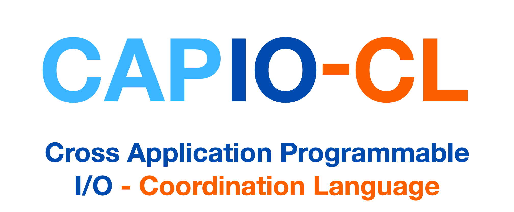

# CAPIO-CL — Cross-Application Programmable I/O Coordination Language

[](https://github.com/High-Performance-IO/CAPIO-CL/actions/workflows/ci-test.yml)
[](https://github.com/High-Performance-IO/CAPIO-CL/actions/workflows/python-bindings.yml)
[](https://codecov.io/gh/High-Performance-IO/CAPIO-CL)


[](https://doi.org/10.1007/s10766-025-00789-0)

**CAPIO-CL** is a novel I/O coordination language that enables users to annotate file-based workflow data dependencies
with **synchronization semantics** for files and directories.
Designed to facilitate **transparent overlap between computation and I/O operations**, CAPIO-CL allows multiple
producer–consumer application modules to coordinate efficiently using a **JSON-based syntax**.

For detailed documentation and examples, please
visit: [https://capio.hpc4ai.it/docs/coord-language/](https://capio.hpc4ai.it/docs/coord-language/)

---

## Overview

The **CAPIO Coordination Language (CAPIO-CL)** allows applications to declare:

- **Data objects**, **I/O dependencies**, and **access modes**
- **Synchronization semantics** across different processes
- **Commit policies** for I/O objects

At runtime, CAPIO-CL’s parser and engine components analyze, track, and manage these declared relationships, enabling *
*transparent data sharing** and **cross-application optimizations**.


---

## Building

### Requirements & dependencies

- C++17 or greater
- Cmake 3.15 or newer
- Python3 to bundle CAPIO-CL json schemas into target binaries
- [danielaparker/jsoncons](https://github.com/danielaparker/jsoncons) to parse, serialize and validate CAPIO-CL JSON
  config files
- [GoogleTest](https://github.com/google/googletest) for automated testing
- [pybind11](https://github.com/pybind/pybind11) when building python wheels

jsoncons, GoogleTest and pybind11 are fetched automatically by CMake — no manual setup required.

### Steps

```bash
Clone
git clone https://github.com/High-Performance-IO/CAPIO-CL.git


mkdir -p CAPIO-CL/build && cd CAPIO-CL/build
cmake ..
make 
```

By default, this will:

- Build the **"libcapio_cl"** static library
- Build the **"CAPIO_CL_tests"** executable (GoogleTest-based)
- Build the **"py_capio_cl"** python bindings (pybind11)

---

## Integration as a Subproject

**CAPIO-CL** can be included directly into another CMake project using:

```cmake
include(FetchContent)

#####################################
# External projects
#####################################
FetchContent_Declare(
        capio_cl
        GIT_REPOSITORY https://github.com/High-Performance-IO/CAPIO-CL.git
        GIT_TAG main
)
FetchContent_MakeAvailable(capio_cl)

#####################################
# Include files and directories
#####################################
target_include_directories(${TARGET_NAME} PRIVATE
        ${capio_cl_SOURCE_DIR}
)

#####################################
# Link libraries
#####################################
target_link_libraries(${PROJECT_NAME} PRIVATE
        libcapio_cl
)
```

When included this way, unit tests and python bindings are **not built**, keeping integration clean for external
projects.

---

## Python Bindings

CAPIO-CL now provides native **Python bindings** built using [pybind11](https://github.com/pybind/pybind11).  
These bindings expose the core C++ APIs (`Engine`, `Parser` and `Serializer`), directly
to Python, allowing the CAPIO-CL logic to be used within python projects.

### Building the Bindings

You can build and install the Python bindings directly from the CAPIO-CL source tree using:

```bash
pip install --upgrade pip
pip install -r build-requirements.txt
python -m build
pip install dst/*.whl
```

This will build the Python wheel and install it into your current environment using an ad-hoc build environment, which
is downloaded, installed, and configured in isolation. A faster way to build and install CAPIO-CL is to use **native
system** packages and then run from within the CAPIO-CL root directory:

```bash
pip install .
```

This assumes that all build dependencies not fetched by cmake are available.

---

## API Snapshot

A simplified example of CAPIO-CL usage in C++:

```c++
#include "capiocl.hpp"

int main() {
    capiocl::Engine engine;
    engine.newFile("Hello_World.txt")
    engine.print();
    
    // Dump engine to configuration file
    capiocl::Serializer::dump(engine, "my_workflow", "my_workflow.json")
    return 0;
}
```

The `py_capio_cl` module provides access to CAPIO-CL’s core functionality through a high-level Python interface.

```python
from py_capio_cl import Engine, Serializer

engine = Engine()
engine.newFile("Hello_World.txt")
engine.print()

# Dump engine to configuration file
Serializer.dump(engine, "my_workflow", "my_workflow.json")
```

# Team

## Developing team

| Name                         | Role                          | Contact                                                                                                      |
|------------------------------|-------------------------------|--------------------------------------------------------------------------------------------------------------|
| **Marco Edoardo Santimaria** | Designer and Maintainer       | [email](mailto:marcoedoardo.santimaria@unito.it)  \| [Homepage](https://alpha.di.unito.it/marco-santimaria/) |
| **Iacopo Colonnelli**        | Workflows Expert and Designer | [email](mailto:iacopo.colonnelli@unito.it)    \| [Homepage](https://alpha.di.unito.it/iacopo-colonnelli/)    |
| **Massimo Torquati**         | Designer                      | [email](mailto:massimo.torquati@unipi.it) \| [Homepage](http://calvados.di.unipi.it/paragroup/torquati/)     |
| **Marco Aldinucci**          | Designer                      | [email](mailto:marco.aldinucci@unito.it)  \| [Homepage](https://alpha.di.unito.it/marco-aldinucci/)          |

### Former Members

| Name                            | Role     | Contact                                                                                                          |
|---------------------------------|----------|------------------------------------------------------------------------------------------------------------------|
| **Alberto Riccardo Martinelli** | Designer | [email](mailto:albertoriccardo.martinelli@unito.it) \| [Homepage](https://alpha.di.unito.it/alberto-martinelli/) |

